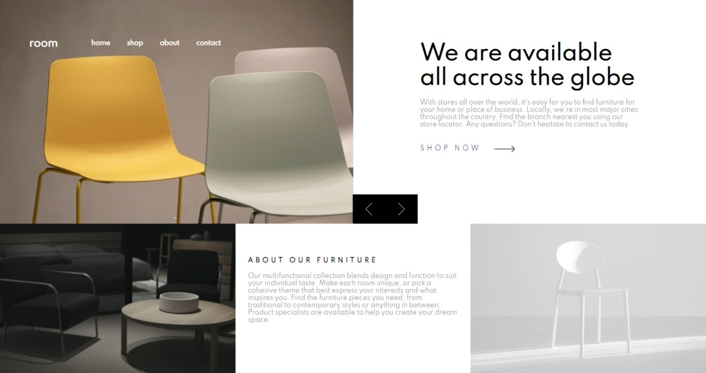

# Frontend Mentor - Room homepage solution

This is a solution to the [Room homepage challenge on Frontend Mentor](https://www.frontendmentor.io/challenges/room-homepage-BtdBY_ENq). Frontend Mentor challenges help you improve your coding skills by building realistic projects.

## The challenge

Users should be able to:

- View the optimal layout for the site depending on their device's screen size
- See hover states for all interactive elements on the page
- Navigate the slider using either their mouse/trackpad or keyboard

## Screenshot

## Links

- Solution URL: [Github repo](https://github.com/JustShuaib/room-homepage)
- Live Site URL: [Live site](https://room-homepage-ecommerce.netlify.app/)

## Built with

- [React](https://reactjs.org/) - JS library
- [SASS](https://sass-lang.com/) - For styles

## Author

- Github - [Adeoti Shuaib](https://www.github.com/JustShuaib)
- Frontend Mentor - [@justshuaib](https://www.frontendmentor.io/profile/justshuaib)
- Twitter - [@JustShuaib](https://www.twitter.com/JustShuaib)
